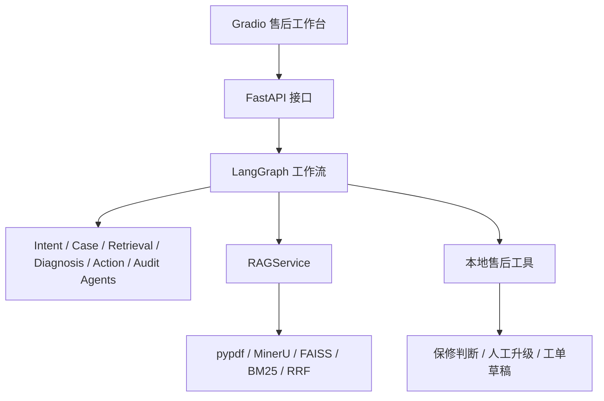

# AfterSalesAgentV2 售后 Agentic RAG 系统

AfterSalesAgentV2 是一个面向售后服务场景的 Agentic RAG 产品 Demo。项目使用 Gradio 作为演示前端，FastAPI 提供后端接口，LangGraph 编排售后 Agent 工作流，并复用本地 RAG、规则库和售后工具。

第一版目标是把售后工作流讲清楚、跑稳定、便于面试展示。当前不接 MCP、GraphRAG、Docker、登录系统和真实企业工单系统。

## 架构



## 启动方式

建议先创建 Python 3.10 虚拟环境：

```powershell
py -3.10 -m venv .venv
.\.venv\Scripts\activate
```

再复制配置模板：

```powershell
copy .env.example .env
```

安装依赖：

```powershell
python -m pip install -r requirements.txt
```

启动 FastAPI：

```powershell
uvicorn api:app --host 127.0.0.1 --port 8800
```

启动 Gradio：

```powershell
python gradio_app.py
```

默认访问地址：

```text
http://127.0.0.1:7860
```

## 使用流程

1. 在 Gradio 的“知识库管理”页上传 PDF。
2. 填写文档类型、产品线、产品型号和版本号。
3. 点击“构建知识库”，构建成功后选择并加载知识库。
4. 在“售后 Agent”页输入客户售后问题。
5. 在“RAG 调试”页可以单独检查知识库检索结果和引用来源。

## 示例问题

```text
QY-320 显示 E03，出水变慢，买了半年
买了一年半还能免费维修吗？
机器漏水把插座打湿了
QY-320 不出水，已经重启过，地址在广州
```

## 返回结果

工作流稳定返回以下字段：

```json
{
  "intent": {},
  "case": {},
  "retrieval": {},
  "diagnosis": {},
  "warranty": {},
  "escalation": {},
  "action": {},
  "audit": {},
  "tool_history": [],
  "trace": []
}
```

其中 `action.customer_reply` 是给客户看的最终回复，`retrieval.results` 展示知识库检索命中，`retrieval.sources` 展示引用来源，`tool_history` 展示本地工具调用记录，`trace` 展示 Agent 节点执行轨迹。

## 测试

```powershell
python -m unittest discover -s tests
```

如果当前环境还没有安装 `fastapi`，API 合约测试会跳过。安装 `requirements.txt` 后会自动启用。

## 当前限制

- 未加载知识库时会返回中文提示，但售后规则和本地工具仍可运行。
- MinerU 只作为复杂 PDF 的补充解析器，默认仍推荐 `pypdf`。
- 如果旧 `mineru` API 在下载 ZIP 阶段失败，可以改用 `langchain-mineru-flash` 或 `langchain-mineru-precision`。
- `langchain-mineru-flash` 不需要 token，`langchain-mineru-precision` 会使用 `.env` 里的 `MINERU_API_TOKEN`。
- MinerU 可能存在正文数字缺失风险，构建知识库后需要做数字完整性检查。
- 工具当前是本地 Python 调用，暂不接 MCP。

## 后续计划

- 增加知识库上传、加载和检索调试页面。
- 增加 LangGraph 节点实时状态展示。
- 在工作流稳定后再考虑 MCP 化售后工具。
- 补充更多售后规则、质保政策和真实工单系统适配层。
