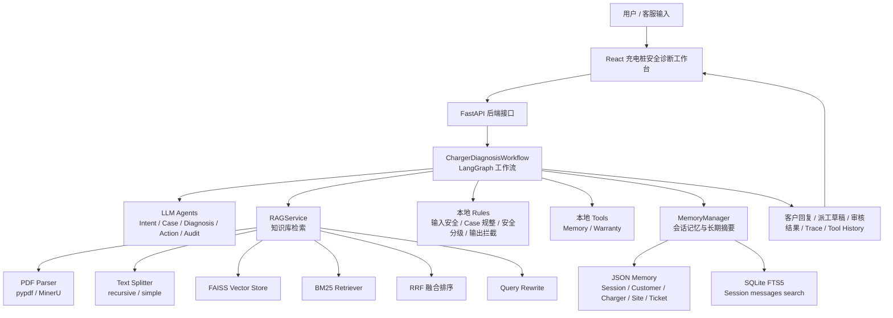
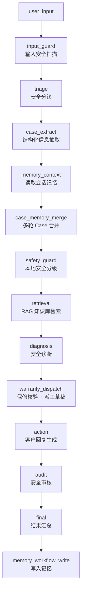
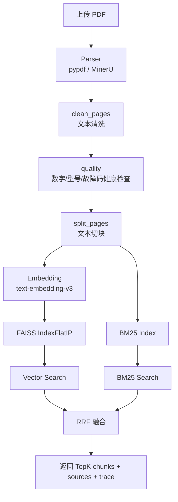

# 新能源家用充电桩售后安全诊断 Agent

本项目是一个面向 **新能源家用充电桩售后场景** 的 Agentic RAG Demo，核心目标是让客服或售后人员基于产品文档、故障码说明、安全规则和保修政策，完成：

* 电气安全风险识别
* 充电桩故障诊断
* 本地知识库检索
* 保修辅助判断
* 派工草稿生成
* 客户回复生成
* 安全审核与治理留痕
* 多轮会话记忆与上下文补全

当前版本使用：

* **React**：轻量级前端工作台
* **FastAPI**：后端接口服务
* **LangGraph**：编排诊断工作流
* **LangChain ChatModel**：统一调用 LLM
* **FAISS + BM25 + RRF**：本地知识库混合检索
* **SQLite FTS5 + JSON Memory**：会话记忆与长期摘要
* **本地 Rules + Tools**：安全规则、保修工具、派工草稿、输出审核

> 说明：`gradio_app.py` 目前仅作为旧版研发备用入口。主前端已经切换为 React，后续以 React + FastAPI 为主。

---

## 1. 项目定位

项目不是普通知识库问答，而是一个带有业务流程、安全护栏和记忆能力的售后 Agent。

它的核心约束是：

1. **安全优先**
   对冒烟、明火、触电、烧焦味、漏电、跳闸、枪线破损、进水、接地异常等场景，必须优先停止充电、远离风险源、必要时断电并转人工或电工处理。

2. **不能编造诊断依据**
   没有知识库依据时，不能随意判断具体故障原因、故障部件、保修政策或技术参数。

3. **不能过度承诺保修**
   回复中不能承诺“一定免费”“保证换新”“无需费用”等，需要结合知识库政策、凭证和人工审核。

4. **记忆不能替代知识库证据**
   Memory 只作为历史上下文和追问补全，不作为诊断依据。真正的诊断依据仍然来自当前输入和 RAG 知识库。

---

## 2. 完整架构

### 2.1 总体架构



---

### 2.2 前端架构

前端位于：

```text
frontend/
```

主要文件：

```text
frontend/package.json
frontend/src/App.tsx
frontend/src/api.ts
frontend/src/types.ts
frontend/src/main.tsx
frontend/src/styles.css
frontend/src/api.test.ts
```

前端职责：

* 提供充电桩安全诊断工作台
* 创建后端 session
* 调用异步 Agent 接口
* 轮询轻量 summary
* 显示工作流节点状态
* 显示客户回复
* 管理知识库上传、加载、删除
* 提供 RAG 检索测试页
* 查看系统状态

前端刻意不渲染完整 `trace`、`tool_history`、RAG 原始 chunk，以避免页面卡顿或内存占用过大。完整调试信息写入后端：

```text
data/run_logs/{run_id}.json
```

---

### 2.3 后端架构

后端核心目录：

```text
backend/
├── agents/
├── llm/
├── memory/
├── prompts/
├── rag/
├── rules/
├── tools/
├── config.py
├── graph_workflow.py
└── schemas.py
```

根目录核心文件：

```text
api.py
README.md
requirements.txt
requirements.lock.txt
.env.example
```

---

### 2.4 FastAPI 接口层

入口文件：

```text
api.py
```

主要职责：

* 提供健康检查
* 创建 memory session
* 管理知识库
* 提供 RAG 检索接口
* 启动同步 / 异步充电桩诊断流程
* 管理异步 run 状态
* 写入 debug log
* 给 React 返回轻量 summary

主要接口：

```text
GET    /health

POST   /api/memory/sessions

GET    /api/kb/list
GET    /api/kb/status
POST   /api/kb/build
POST   /api/kb/load
DELETE /api/kb/{database_id}

POST   /api/rag/search

POST   /api/charger-diagnosis/run
POST   /api/charger-diagnosis/start
GET    /api/charger-diagnosis/runs/{run_id}
GET    /api/charger-diagnosis/runs/{run_id}?view=summary
```

其中 React 高频轮询使用：

```text
GET /api/charger-diagnosis/runs/{run_id}?view=summary
```

该接口只返回轻量信息，避免把完整 RAG 证据、trace、tool_history 直接塞给前端高频渲染。

---

### 2.5 LangGraph 工作流

核心文件：

```text
backend/graph_workflow.py
```

主流程：



当前工作流输出字段：

```json
{
  "input_safety": {},
  "triage": {},
  "case": {},
  "memory_context": {},
  "retrieval": {},
  "safety": {},
  "diagnosis": {},
  "warranty": {},
  "dispatch": {},
  "action": {},
  "audit": {},
  "governance": {},
  "tool_history": [],
  "trace": []
}
```

---

### 2.6 Agent 层

目录：

```text
backend/agents/
```

主要 Agent：

```text
intent_agent.py
case_extract_agent.py
retrieval_agent.py
diagnosis_agent.py
action_agent.py
audit_agent.py
llm_utils.py
```

职责：

* `ChargerTriageAgent`：识别客户意图和安全诉求
* `ChargerCaseExtractAgent`：抽取充电桩型号、故障码、安全信号、联系方式等字段
* `RetrievalAgent`：适配 RAGService
* `ChargerDiagnosisAgent`：基于 case、retrieval、tools 生成诊断
* `ChargerActionAgent`：生成客户回复和内部建议
* `ChargerAuditAgent`：审核回复安全性、依据性和保修承诺风险

Agent 层尽量只负责 LLM JSON 语义能力。硬规则、拦截、兜底逻辑放在 `rules/` 层。

---

### 2.7 Prompt 层

目录：

```text
backend/prompts/
```

主要文件：

```text
intent.py
case_extract.py
diagnosis.py
action.py
audit.py
```

所有 LLM Agent 都通过 LangChain `ChatPromptTemplate` 组织提示词，并要求输出 JSON。

---

### 2.8 Rules 层

目录：

```text
backend/rules/
```

主要文件：

```text
input_rules.py
case_rules.py
safety_rules.py
dispatch_rules.py
output_rules.py
```

职责：

* `input_rules.py`

  * 检测提示注入
  * 检测越权请求
  * 检测敏感信息风险
  * 生成治理摘要

* `case_rules.py`

  * 对 LLM case 抽取结果做规整
  * 提供结构化兜底
  * 计算缺失信息
  * 合并会话中的 last_case

* `safety_rules.py`

  * 识别高风险安全信号
  * 识别安全相关故障码
  * 生成风险等级
  * 强制高风险回复规则

* `dispatch_rules.py`

  * 生成派工草稿
  * 生成证据清单
  * 判断是否需要上门、电工、人工介入

* `output_rules.py`

  * 拦截危险回复
  * 拦截过度保修承诺
  * 无知识库依据时清空具体故障原因
  * 合并 LLM 审核和本地审核 warning

---

### 2.9 Tools 层

目录：

```text
backend/tools/
```

主要文件：

```text
base.py
memory.py
warranty.py
```

职责：

* `base.py`

  * ToolResult
  * BaseTool
  * ToolRegistry

* `memory.py`

  * `MemoryContextReadTool`
  * `MemoryWorkflowWriteTool`
  * 读取/写入当前会话和长期摘要
  * 明确 memory 不作为诊断证据

* `warranty.py`

  * 从知识库检索结果中提取保修期限
  * 根据购买/安装时间计算是否可能在保修期内
  * 只做辅助判断，不直接承诺免费

当前工具是本地 Python 调用，暂未接 MCP。

---

### 2.10 RAG 架构

目录：

```text
backend/rag/
```

主要文件：

```text
cleaners.py
embeddings.py
kb_manager.py
parsers.py
prompts.py
quality.py
rag_service.py
rerankers.py
retrievers.py
splitters.py
stores.py
utils.py
web_searcher.py
```

RAG 流程：



支持的检索模式：

```text
hybrid
vector
bm25
```

默认参数：

```text
DEFAULT_PARSER = pypdf
DEFAULT_SPLITTER = recursive
DEFAULT_CHUNK_SIZE = 700
DEFAULT_CHUNK_OVERLAP = 80
DEFAULT_VECTOR_TOP_K = 10
DEFAULT_BM25_TOP_K = 10
DEFAULT_FINAL_TOP_K = 5
DEFAULT_USE_QUERY_REWRITE = true
DEFAULT_QUERY_REWRITE_COUNT = 3
```

---

### 2.11 Memory 架构

目录：

```text
backend/memory/
```

当前记忆分为两层：

#### 1. JSON 记忆

JSON 是 Source of Truth。

包括：

```text
SessionMemory   会话级记忆
CustomerMemory  客户级记忆
ChargerMemory   设备/型号级记忆
SiteMemory      现场/城市级记忆
TicketMemory    工单级记忆
```

默认存储路径：

```text
data/memory/
```

大致结构：

```text
data/memory/
├── sessions/
│   └── {session_id}/
│       ├── conversation.json
│       └── context.json
├── customers/
│   └── index.json
├── chargers/
│   └── index.json
├── sites/
│   └── index.json
├── tickets/
│   ├── index.json
│   └── {ticket_id}.json
└── session_search.sqlite
```

#### 2. SQLite FTS5

SQLite FTS5 只索引 Session messages，用于当前会话消息搜索。

它不是主存储，不替代 JSON。

作用：

* 搜索当前 session 的历史消息
* 支持 memory answer 读取最近相关信息
* 不作为 RAG 知识库
* 不作为诊断依据

---

## 3. 目录结构

```text
AfterSalesAgentV2/
├── api.py
├── README.md
├── requirements.txt
├── requirements.lock.txt
├── .env.example
├── backend/
│   ├── agents/
│   ├── llm/
│   ├── memory/
│   ├── prompts/
│   ├── rag/
│   ├── rules/
│   ├── tools/
│   ├── config.py
│   ├── graph_workflow.py
│   └── schemas.py
├── frontend/
│   ├── package.json
│   ├── vite.config.ts
│   ├── index.html
│   └── src/
│       ├── App.tsx
│       ├── api.ts
│       ├── api.test.ts
│       ├── main.tsx
│       ├── styles.css
│       ├── types.ts
│       └── vite-env.d.ts
├── tests/
│   ├── sample_cases.json
│   ├── test_api_contract.py
│   ├── test_graph_workflow.py
│   ├── test_kb_manager.py
│   ├── test_llm_agents.py
│   ├── test_llm_factory.py
│   ├── test_local_tools.py
│   ├── test_memory.py
│   ├── test_mineru_download_config.py
│   ├── test_parser_options.py
│   └── test_project_structure.py
├── data/
│   ├── uploads/
│   ├── parsed_json/
│   ├── markdown/
│   ├── chunks/
│   ├── indexes/
│   ├── memory/
│   └── run_logs/
├── logs/
└── Document_pdfs/
```

不建议提交到 Git 的目录：

```text
.venvV2/
node_modules/
dist/
.npm-cache/
__pycache__/
data/indexes/
data/chunks/
data/parsed_json/
data/markdown/
data/memory/
data/run_logs/
.env
```

---

## 4. 环境变量

复制环境变量模板：

```powershell
copy .env.example .env
```

至少需要配置：

```env
API_KEY=你的 DashScope API Key
```

常用配置示例：

```env
DEFAULT_LLM_PROVIDER=qwen
DASHSCOPE_BASE_URL=https://dashscope.aliyuncs.com/compatible-mode/v1
DEFAULT_CHAT_MODEL=qwen-plus
DEFAULT_EMBEDDING_MODEL=text-embedding-v3

FASTAPI_HOST=127.0.0.1
FASTAPI_PORT=8800

GRADIO_HOST=127.0.0.1
GRADIO_PORT=7860

DEFAULT_PARSER=pypdf
DEFAULT_CHUNK_SIZE=700
DEFAULT_CHUNK_OVERLAP=80
DEFAULT_VECTOR_TOP_K=10
DEFAULT_BM25_TOP_K=10
DEFAULT_FINAL_TOP_K=5
DEFAULT_USE_QUERY_REWRITE=true

MINERU_API_TOKEN=
MINERU_DOWNLOAD_VERIFY_SSL=true

# 功能开关
MEMORY_ANSWER_V2=false   # 设为 true 开启 LLM 驱动记忆精确问答（v2）
```

如果没有配置 LLM key，流程不会直接崩溃，会退回到本地 rules、tools 和 RAG 的兜底逻辑。

---

## 5. 启动方式

### 5.1 创建 Python 环境

推荐使用项目已有虚拟环境：

```powershell
D:\AfterSalesAgentV2\.venvV2\Scripts\activate
```

如果需要重新创建：

```powershell
cd /d D:\AfterSalesAgentV2
py -3.10 -m venv .venvV2
.\.venvV2\Scripts\activate
python -m pip install --upgrade pip
python -m pip install -r requirements.txt
```

---

### 5.2 启动 FastAPI 后端

```powershell
cd /d D:\AfterSalesAgentV2
D:\AfterSalesAgentV2\.venvV2\Scripts\python.exe -m uvicorn api:app --host 127.0.0.1 --port 8800
```

健康检查：

```text
http://127.0.0.1:8800/health
```

如果返回：

```json
{
  "status": "ok",
  "service": "ChargerSafetyDiagnosis API"
}
```

说明后端正常。

---

### 5.3 启动 React 前端

```powershell
cd /d D:\AfterSalesAgentV2\frontend
npm.cmd install --cache D:\AfterSalesAgentV2\.npm-cache
npm.cmd run dev -- --host 127.0.0.1 --port 5173
```

访问：

```text
http://127.0.0.1:5173
```

---

### 5.4 Gradio 备用入口

当前 Gradio 已不是主前端。仅在需要旧版研发演示时启动：

```powershell
cd /d D:\AfterSalesAgentV2
D:\AfterSalesAgentV2\.venvV2\Scripts\python.exe gradio_app.py
```

---

## 6. 使用流程

1. 启动 FastAPI 后端。
2. 启动 React 前端。
3. 打开 React 页面。
4. 在“知识库管理”上传 PDF。
5. 填写知识库名称、文档类型、产品线、版本号等。
6. 构建知识库。
7. 加载知识库。
8. 进入“充电桩安全诊断 Agent”。
9. 输入客户问题。
10. 点击运行。
11. 查看：

    * 工作流节点状态
    * 客户回复
    * run_id
    * session_id
    * debug_log_path
12. 如需完整调试，查看：

```text
data/run_logs/{run_id}.json
```

---

## 7. 示例问题

```text
VoltGate VG-11KW-Pro 无法启动充电，屏幕显示 C-RCD-04，漏保频繁跳闸，东莞。
```

```text
VG-WallBox2 充到一半停止，App 显示 C-COM-12，想知道要不要上门。
```

```text
充电桩枪线破皮，还有烧焦味，能不能直接换新？
```

```text
VG-CloudMini APP 离线，昨天开始连不上，暂时没有明显发热或跳闸。
```

```text
刚才那个型号你还记得吗？
```

---

## 8. 测试方式

### 8.1 后端单元测试

```powershell
cd /d D:\AfterSalesAgentV2
D:\AfterSalesAgentV2\.venvV2\Scripts\python.exe -m unittest discover -s tests -v
```

### 8.2 Python 编译检查

```powershell
cd /d D:\AfterSalesAgentV2
D:\AfterSalesAgentV2\.venvV2\Scripts\python.exe -m compileall backend api.py gradio_app.py
```

### 8.3 前端测试

```powershell
cd /d D:\AfterSalesAgentV2\frontend
npm.cmd run test
```

### 8.4 前端构建

```powershell
cd /d D:\AfterSalesAgentV2\frontend
npm.cmd run build
```

---

## 9. 当前安全护栏

本地规则会识别以下风险：

```text
明火
起火
着火
火苗
冒烟
配电箱冒烟
触电
电到人
人员受伤
火花
打火
烧焦味
焦糊味
漏电
麻手
漏保频繁跳闸
漏电保护频繁跳闸
空开跳闸
枪线破皮
枪线破损
枪头发热
车辆充电口发热
充电口发热
过热
进水
雨水倒灌
积水
接地异常
接地故障
私拉乱接
自行拆盖
私自拆开
```

安全相关故障码：

```text
C-GND-01：接地异常
C-RCD-04：漏保自检失败
C-TEMP-09：枪头温度过高
```

高风险回复必须包含：

* 停止充电或暂停使用
* 远离充电桩、枪线、车辆充电口、配电箱等风险源
* 在确保自身安全时切断充电桩或上级空开电源
* 不要自行拆修
* 转人工、电工或上门工程师处理
* 如存在明火、持续冒烟、触电或人员受伤，优先联系当地应急救援

---

## 10. 当前限制

1. 未加载知识库时，系统不会编造具体故障原因。
2. 保修判断必须依赖知识库中的保修期限和客户提供的购买/安装时间。
3. Memory 当前只用于上下文补全，不作为诊断证据。
4. Gradio 前端已不作为主入口。
5. 工具当前是本地 Python 调用，暂未接 MCP。
6. React 前端为了轻量化，只展示 summary，不展示完整 trace 和 RAG 原始 chunk。
7. MinerU 依赖外部 API 和网络环境，可能出现 ZIP 下载失败、SSL 校验失败或 CDN 连接中断。
8. 复杂 PDF、扫描件、图片型 PDF 仍可能需要人工检查解析质量。

---

## 11. 后续计划

### 核心原则（适用于以下所有子计划）

1. **LLM 做语义理解，不做硬编码修补**：意图识别、字段抽取、记忆问答、诊断推理等语义任务，一律通过 LLM + Prompt + JSON Schema 完成。不在代码层增加新的 if/else 问法匹配、keyword 列表、正则语义猜测。
2. **本地规则做确定性兜底，不做语义猜测**：本地 Python 代码的合法职责仅限于——安全信号硬拦截（明火/触电等，这是安全性硬需求）、确定性字段提取（手机号格式、故障码格式、功率单位归一化、时间格式）、格式校验、LLM 不可用时的降级兜底。本地规则**禁止**做品牌/型号/问题类型等语义判断。
3. **固定数据配置化，不内联在代码中**：安全关键词、故障码映射、提示注入模式、输出拦截词列表等固定数据，一律从 Python 代码迁移到 `data/rules/` 下的 JSON/YAML 配置文件。
4. **通过 Schema 约束替代代码修补**：LLM 输出不稳定时，优先优化 Prompt 和输出 Schema 的约束力，而非在代码层增加后处理 if/else。
5. **清理优先于新增**：每新增一项能力之前，先清理与之对应的旧硬编码逻辑。
6. **新增能力配评估集**：涉及 LLM 语义能力的改动（Prompt 变更、Schema 变更、LLM 驱动的新功能），必须同步新增或更新对应的 eval 集，防止能力退化。

---

### 11.1 硬编码清理（最高优先级）

在开始任何新功能之前，先对现有代码中的硬编码做一次系统性清理。

**原则**：不新增”问法级硬编码”，但保留”受控业务 Schema”——即不是把一切交给 LLM 随意发明，而是让 LLM 在一个受限、可校验的字段空间内工作。

#### 11.1.1 审查并标记所有硬编码位置

逐文件审查以下位置的硬编码（不限于 `rules/` 目录）：

| 文件 | 当前硬编码 | 处理方式 |
|------|-----------|----------|
| `safety_rules.py` | 安全关键词列表（明火、冒烟、触电…） | 迁移到 `data/rules/safety_keywords.json` |
| `safety_rules.py` | 安全故障码列表（C-GND-01…） | 迁移到 `data/rules/fault_code_map.json` |
| `input_rules.py` | 提示注入检测模式 | 迁移到 `data/rules/prompt_injection_patterns.json` |
| `output_rules.py` | 输出拦截关键词 | 迁移到 `data/rules/output_blocklist.json` |
| `case_rules.py` | 品牌/型号/功率正则语义抽取 | **删除**，改为 LLM 抽取 |
| `case_rules.py` | 手机号正则、故障码格式正则、功率单位归一化 | **保留**，加 `# deterministic:` 注释 |
| `dispatch_rules.py` | 派工模板字符串 | 迁移到 `data/rules/dispatch_templates.json` |
| `graph_workflow.py` | `_is_memory_recall_query()` 中字段级硬编码匹配 | **删除**，改为调用 `parse_memory_query()` |
| `graph_workflow.py` | `_memory_query_type()` 中 if/else 问法分支 | **删除**，字段选择由 LLM 完成 |
| `graph_workflow.py` | `_build_memory_reply()` 中字段拼接模板 | **重构**，改为 LLM 生成回答 |
| `backend/agents/` | Agent 内部可能散落的字段判断 if/else | 审查后清理，改为依赖 Schema 约束 |
| `backend/prompts/` | Prompt 中可能硬编码的字段列表或示例值 | 审查后改为引用 `schemas.py` 字段定义 |
| `backend/schemas.py` | 暂无已知硬编码，但需确认 dataclass 字段是否与 Prompt 要求一致 | 审查对齐 |
| `frontend/src/` | 前端可能散落的字段名硬编码、状态字符串硬编码 | 审查后改为引用 `types.ts` 中的类型定义 |

#### 11.1.2 删除不应存在的硬编码

- 凡是可以被 LLM + Schema 替代的**语义字段抽取** if/else 和正则，一律删除（品牌、型号、问题类型、客户请求等）
- 凡是”先硬编码快速上线、后续再改”的临时逻辑，立即清理

#### 11.1.3 建立配置文件目录结构

```
data/rules/
├── safety_keywords.json          # 安全关键词（高风险 / 中风险 / 低风险分级）
├── fault_code_map.json           # 故障码 → 含义 / 风险等级 / 相关部件 映射
├── prompt_injection_patterns.json # 提示注入检测模式
├── output_blocklist.json          # 输出拦截词（过度保修承诺 / 危险建议）
└── dispatch_templates.json       # 派工草稿模板
```

配置文件格式要求：
- JSON 不支持顶部注释，每个文件用 `_meta` 字段记录元信息：
  ```json
  {
    "_meta": {
      "description": "安全关键词配置，按风险等级分组",
      "loaded_by": "backend/rules/safety_rules.py",
      "last_updated": "2026-06-07"
    },
    "high_risk": ["明火", "触电", "冒烟", ...]
  }
  ```
- 字段名与 `schemas.py` 中的字段名保持一致
- **热加载分两阶段**：
  - **第一阶段**：启动时加载配置（`ensure_project_dirs()` 时一次性读入），当前即可实现
  - **第二阶段**：后续增加 `POST /api/admin/reload-rules` 接口，允许不重启服务更新配置

#### 11.1.4 增加反硬编码回归检查

- 新增 PR 检查项：`rules/` 目录下禁止新增 keyword 列表、if/else 字段匹配、正则语义抽取
- 新增 CI 脚本或测试用例：扫描 `rules/*.py` 中是否出现新的疑似硬编码模式
- **使用 allowlist 避免误杀**：以下确定性规则不在禁止范围内——
  - 手机号正则（`extract_phone`）
  - 故障码格式正则（`extract_fault_codes`）
  - 功率单位归一化（`normalize_power_kw`）
  - 城市名校验列表（`validate_city`，数据来自配置文件）
  - 安全关键词列表（来自 `data/rules/safety_keywords.json`）
  - 其他经注释声明为"确定性格式规则"的 `re.compile` 调用
- allowlist 机制：每个保留的 `re.compile` 或 `list[str]` 赋值上方必须有注释 `# deterministic: <用途说明>`，CI 扫描时跳过带此标记的行
- 如确实需要新增固定值，必须先说明为什么 LLM 无法解决，并将数据放在 `data/rules/` 配置文件中

---

### 11.2 Memory Answer 精确问答 ✅ 已完成

**状态**：开发完成，通过 `MEMORY_ANSWER_V2=true` 环境变量开启。

**目标**：让系统能精确回答”刚才我说的型号是什么？””上次工单优先级？””还缺哪些信息？”等记忆召回问题。

#### 11.2.1 实现架构（v2）

```
用户输入
  → _is_memory_recall_query() 粗粒度关键词判断（保留不变，旧链路 [deprecated]）
  → MEMORY_ANSWER_V2=true 时进入新链路：
     1. _parse_memory_query()       → LLM 解析查询意图 → MemoryQueryResult
     2. _resolve_memory_fields()    → Pass1 结构化来源 (high) + Pass2 FTS5 (medium) → MemoryFieldResolution
     3. _build_memory_answer_llm()  → LLM 生成自然语言回答 → 不可用时回退 _build_memory_reply_v2()
```

**核心文件**：

| 文件 | 模块 |
|------|------|
| `backend/schemas.py` | `MemoryQueryResult`（29 字段枚举 + clean/normalize），`MemoryFieldResolution`（resolved/missing/confidence/sources），`normalize_power_kw()` |
| `backend/prompts/memory_query.py` | `MEMORY_QUERY_PARSE_PROMPT`，`FTS5_FIELD_EXTRACTION_PROMPT`（含 source_index），`MEMORY_ANSWER_GENERATION_PROMPT`（含 7 条约束） |
| `backend/graph_workflow.py` | 6 个 v2 方法：parse / resolve / fts5_extract / answer_llm / format / clean / validate |
| `backend/config.py` | `MEMORY_ANSWER_V2 = read_bool_env(“MEMORY_ANSWER_V2”, False)` |
| `tests/eval/test_memory_parse.py` | 56 条单元测试（schema / resolver / fts5 / reply / answer_llm） |
| `tests/eval/memory_answer_eval.json` | 10 条评估用例 |

#### 11.2.2 受控字段枚举（29 个）

所有字段定义在 `MEMORY_QUERY_TARGET_FIELDS` 中，带来源 dataclass 注释：

- **设备信息**（ChargerCase）：brand, charger_model, charger_series, rated_power_kw, charger_type, connector_type, serial_number
- **现场信息**（ChargerCase）：city, contact_address, installation_type, purchase_or_install_time
- **故障信息**（ChargerCase）：fault_codes, observed_symptoms, safety_signals, environment_factors, trip_status, indicator_status
- **安全与诊断**（SafetyResult / ChargerDiagnosisResult）：risk_level, need_onsite, need_electrician, diagnosis_summary, suggested_next_step
- **工单信息**（DispatchDraft / ChargerCase）：ticket_id, ticket_title, ticket_priority, missing_info
- **对话与回复**（SessionMemory）：last_customer_reply, last_user_message, customer_request

LLM 不能发明枚举外的字段；非法字段自动丢弃并记录 warning trace。

#### 11.2.3 双阶段 Field Resolver

**Pass 1 — 结构化来源（confidence=high）**：
按来源路由表 `_ROUTE_MAP` 读取：`last_case.*` / `recent_safety.*` / `session.last_diagnosis.*` / `recent_ticket.*` / `last_customer_reply` / `missing_info`

**Pass 2 — FTS5 fallback（confidence=medium）**：
- 仅在 Pass 1 有缺失字段时触发
- 使用当前 `entities + user_input` 构建查询词，重新调用 `SessionSearchIndex.search()`
- 候选证据带显式编号 `[i][role]` 传入 Prompt
- LLM 从候选片段抽取字段值并返回 `source_index`
- 不覆盖 Pass 1 已命中的 high 置信度字段

#### 11.2.4 confidence 计算规则（source-aware）

| 条件 | confidence |
|------|-----------|
| 全部字段来自结构化来源 | `high` |
| 任何字段来源为 `fts5.*`（即使全部补齐） | **最高 `medium`** |
| 部分命中（无 fts5） | `medium` |
| 全部缺失 | `low` |

#### 11.2.5 Answer LLM 约束

`MEMORY_ANSWER_GENERATION_PROMPT` 7 条约束：
1. 只能根据 resolved_values 回答，不编造
2. missing_fields 必须明确提示”当前会话记忆中没有找到”
3. confidence=medium 时使用”从当前会话记录中看””根据历史消息推断”等措辞
4. 不输出技术标记（confidence、source、字段名等），`_clean_answer_output` 负责清洗
5. 记忆不是诊断证据
6. 不追问用户补充信息
7. `is_memory_query=false` 时简短引导

**防编造校验**：`_validate_answer_fields()` 检查回答是否对缺失字段做了肯定陈述（如”序列号是SN2024-001”），检测到编造 → 回退 `_build_memory_reply_v2()`。

#### 11.2.6 Debug trace 字段

每次 memory_answer v2 调用写入 trace：

| 字段 | 来源 |
|------|------|
| `parse_result` | `_parse_memory_query()` 完整输出 |
| `resolution` | `_resolve_memory_fields()` 完整输出（resolved/missing/confidence/sources） |
| `answer_llm_used` | LLM 是否成功生成回答 |
| `answer_prompt_input_summary` | Prompt 变量摘要 |
| `answer_fallback_reason` | 回退原因（llm_unavailable / llm_empty_response / answer_validation_failed） |
| `final_memory_answer` | 最终返回给客户的回答文本 |
| FTS5 7 项 | fts5_query / fts5_matches_count / fts5_candidate_evidence / fts5_extracted_values / fts5_extracted_sources / fts5_missing_fields / fts5_search_source |

#### 11.2.7 开启方式

```bash
# .env 中设置
MEMORY_ANSWER_V2=true

# 验证
python tests/eval/test_memory_parse.py   # 56 条全部通过
```

关闭 `MEMORY_ANSWER_V2=false`（默认）时，旧链路（`_memory_query_type` / `_build_memory_reply`）行为不变，所有旧函数标记 `[deprecated]`。

---

### 11.3 Case 抽取与记忆写入稳定性

**目标**：case 字段抽取做到”LLM 做语义抽取，本地规则只做确定性字段提取、格式校验和单位归一化”。

**边界定义**：

| 职责 | 负责层 | 示例 |
|------|--------|------|
| 品牌/型号/问题类型/症状/客户请求 语义识别 | LLM | “特斯拉家充” → brand: 特斯拉 |
| 手机号格式提取 | 本地正则 | “13812345678” → contact_phone |
| 故障码格式识别 | 本地正则 | “C-RCD-04” → fault_codes |
| 功率单位归一化 | 本地函数 | “7千瓦”/”7 KW”/”7kW” → rated_power_kw: 7kW |
| 时间表达式标准化 | 本地函数 | “去年3月” → install_time（相对时间转绝对时间由 LLM 完成，本地只做格式校验） |
| 城市确定性提取 | LLM 为主，本地只做已知城市名校验 | “东莞” → city（LLM 抽取，本地校验；不在列表则保留原值标记 unverified） |

#### 11.3.1 删除不应存在的本地正则

从 `case_rules.py` 中删除以下语义猜测逻辑：
- 品牌名称正则匹配（如 `re.compile(r”(特斯拉|华为|BYD|...)”)`)
- 型号名称正则匹配
- 问题类型从关键词推断

这些全部改为 LLM 通过 Prompt + JSON Schema 抽取。

#### 11.3.2 保留并规范化本地确定性规则

保留以下纯格式/标准化逻辑：
- `extract_phone()`：手机号格式提取（`\d{11}` 或 `\d{3}-\d{4}-\d{4}`）
- `extract_fault_codes()`：故障码格式识别（`C-[A-Z]+-\d{2}` 模式）
- `normalize_power_kw()`：功率单位归一化（”7千瓦”/”7 KW”/”7kW”/”7k” → “7kW”）
- `validate_city()`：城市名有效性校验（与已知城市列表对比——列表在配置文件中，不在代码里）。**不在列表中的城市不删除**，保留原值并标记 `unverified`，供人工确认。
- `normalize_date_format()`：时间格式标准化（格式校验，不做语义转换）。时间字段保留 `raw`（用户原文）和 `normalized`（标准化后）两个版本。

这些函数职责受限：输入是字符串，输出是标准化后的字符串或 None。不做语义判断。

#### 11.3.3 LLM 全权负责语义抽取

- 品牌、型号、系列、问题类型、症状描述、客户请求等全部由 LLM 从用户输入中抽取
- 通过 JSON Schema 约束输出格式（字段名与 `ChargerCase` dataclass 对齐）
- Prompt 中明确要求 LLM 只输出它能从用户输入中推断的字段，不确定的字段留空
- 支持中文、英文、缩写、混合表达、海外品牌、非固定命名格式
- **不维护品牌白名单、型号列表、功率映射表**

#### 11.3.4 抽取来源标记

每条字段标注来源，用于下游审核和可解释性：

```json
{
  “brand”: {
    “value”: “特斯拉”,
    “source”: “llm_extract”,
    “confidence”: “high”
  },
  “contact_phone”: {
    “value”: “13812345678”,
    “source”: “regex_extract”
  }
}
```

来源枚举：`llm_extract` / `regex_extract` / `memory_merge` / `user_current_input` / `previous_turn`

#### 11.3.5 写入字段扩展

在现有字段基础上扩展写入：

- `brand` / `charger_model` / `charger_series` / `rated_power_kw`
- `install_time` / `trip_status` / `indicator_status`
- `customer_request`（客户明确提出的诉求，如”想换新””要上门”）

#### 11.3.6 兜底策略

- LLM 抽取失败或不可用时 → `case` 字段保持空值 → 下游 `diagnosis` Agent 在 Prompt 中看到空字段时应回复”信息不足，需要补充以下字段：...”
- 不做硬编码猜测填充
- 确定性字段（手机号、故障码）即使 LLM 失败也继续由本地规则提取

#### 11.3.7 新增评估集

涉及 LLM 语义能力的改动，必须同步维护评估集，防止 Prompt 变更后能力退化：

- `tests/eval/case_extract_eval.json`：覆盖中文/英文/混合表达、不同功率写法、海外品牌、自然语言描述等场景
- `tests/eval/memory_answer_eval.json`：覆盖字段召回、字段缺失提示、多轮上下文追问等场景
- `tests/eval/safety_eval.json`：覆盖高风险/中风险/低风险场景的安全分级和输出拦截

评估集格式：
```json
[
  {
    “input”: “我这个是特斯拉家充，7千瓦，装在地下车库，昨天开始充不进去电”,
    “expected”: {
      “brand”: “特斯拉”,
      “rated_power_kw”: “7kW”,
      “installation_type”: “车库”
    }
  }
]
```

评估脚本定期运行，对比 LLM 输出与 expected，输出准确率和错误案例。

---

### 11.4 RAG 检索增强

计划：

1. 增强 Query Rewrite

   * 按故障码改写
   * 按型号改写
   * 按安全风险改写
   * 按保修政策改写
   * 按派工诉求改写

2. 增强 Rerank

   * 当前已有 LLM rerank 基础能力
   * 后续可加入更稳定的结构化 rerank 分数
   * 避免 irrelevant chunk 进入诊断上下文

3. 增强引用质量

   * 输出文件名
   * 页码
   * chunk_id
   * 文档类型
   * 产品型号
   * 版本号

4. 增加知识库质量检查

   * 数字完整性
   * 型号完整性
   * 故障码完整性
   * 表格解析质量
   * 保修期限识别质量

---

### 11.5 前端增强

当前 React 前端已经替代 Gradio，后续可继续增强：

1. 增加完整 run log 查看页
   当前只显示 debug_log_path，后续仍以服务端日志文件和本地 logs 目录保存为主，不计划在前端直接展示完整日志内容，避免暴露内部 trace、tool history 和大体积调试信息。

2. 增加节点详情弹窗
   点击节点后查看：

   * input
   * output
   * duration
   * warning
   * error

3. 增加 RAG 证据预览
   当前只展示简要 source summary。后续可手动展开查看 top chunks，但需要限制展示数量与单段长度，例如仅展示 Top 3~5 chunks，并对 chunk 内容进行截断与折叠，避免前端一次性渲染大量文本导致页面卡顿、信息噪声过高或暴露过多内部检索上下文。

4. 避免增加低价值交互控件，优先保持界面简洁。

5. 工单草稿优先保证工单内容结构清晰、便于人工快速阅读和二次编辑，避免前端交互逐渐复杂化。

6. 增加安全风险红黄绿标识。

7. 增加知识库构建进度显示。

8. 在系统状态区域增加轻量级运行状态展示，优先保留对实际使用有帮助的信息，包括：

   * FastAPI 服务在线状态
   * 当前 API 延迟
   * 已加载知识库数量
   * 当前默认模型
   * 最近一次健康检查时间

   不建议在系统状态区域堆叠大量低价值调试信息，例如：

   * 完整 trace
   * tool history
   * 原始 prompt
   * 全量环境变量
   * 大体积日志内容
   * 内部异常堆栈

   系统状态区域应保持"轻量、稳定、可快速判断系统是否可用"的原则，复杂调试信息继续保留在服务端日志与 debug log 文件中。

---

### 11.6 API 与运行稳定性增强

计划：

1. 增加 run 取消接口：

   ```text
   POST /api/charger-diagnosis/runs/{run_id}/cancel
   ```

2. 增加 run log 查询接口：

   ```text
   GET /api/charger-diagnosis/runs/{run_id}/debug-log
   ```

3. 增加清理旧 run log 的接口或脚本。

4. 增加统一错误码：

   * KB_NOT_LOADED
   * LLM_UNAVAILABLE
   * RETRIEVAL_EMPTY
   * WORKFLOW_TIMEOUT
   * MINERU_DOWNLOAD_FAILED

5. 增加 API contract 测试覆盖。

---

### 11.7 MCP 工具化计划

当前工具是本地 Python Tool。后续可以考虑改造成 MCP，但不是当前第一优先级。

计划方向：

1. 将 warranty_check 暴露为 MCP tool。
2. 将 memory_context_read 暴露为 MCP tool。
3. 将 memory_workflow_write 暴露为 MCP tool。
4. 将 dispatch_draft 暴露为 MCP tool。
5. 保留本地 Python fallback，避免 MCP 服务不可用时主链路崩溃。
6. 工具调用轨迹继续写入 `tool_history`。

---

### 11.8 测试计划

继续维护 tests，防止重构时破坏核心行为。

重点测试：

1. 项目结构测试
2. API contract 测试
3. LangGraph workflow 测试
4. Memory 测试
5. Local rules 测试
6. LLM agents 测试
7. RAG manager 测试
8. Parser options 测试
9. MinerU 下载配置测试
10. React API client 测试

推荐每次重构后执行：

```powershell
D:\AfterSalesAgentV2\.venvV2\Scripts\python.exe -m unittest discover -s tests -v
D:\AfterSalesAgentV2\.venvV2\Scripts\python.exe -m compileall backend api.py gradio_app.py
cd frontend
npm.cmd run test
npm.cmd run build
```

---

## 12. 当前版本总结

当前项目已经完成了一个相对完整的售后 Agent 闭环：

```text
React 前端
→ FastAPI
→ LangGraph 工作流
→ LLM Agents
→ 本地安全规则
→ RAG 检索
→ 保修工具
→ 派工草稿
→ 客户回复
→ 审核治理
→ 会话记忆（含 Memory Answer v2 精确问答）
→ Debug Log
```

### 已完成的核心交付

| 里程碑 | 状态 | 关键产出 |
|--------|------|---------|
| memory_answer v2 | ✅ 完成 | parse → resolve（结构化+FTS5）→ answer LLM，56 条测试，feature flag 控制 |
| 会话记忆 + FTS5 | ✅ 完成 | SessionMemory + SessionSearchIndex（SQLite FTS5）+ MemoryManager |
| 安全护栏 | ✅ 完成 | safety_rules.py / input_rules.py / output_rules.py / case_rules.py |
| React 前端 | ✅ 完成 | 安全诊断工作台，RunLog 查看，知识库构建，系统状态 |
| FastAPI 后端 | ✅ 完成 | 同步 + 流式 SSE 接口，CORS |
| RAG 知识库 | ✅ 完成 | FAISS + BM25 + RRF 混合检索，pypdf / MinerU 双解析器 |
| Gradio 旧版入口 | 🟡 保留 | gradio_app.py 作为备用 |

### memory_answer v2 技术亮点

- **零硬编码语义匹配**：字段选择完全由 LLM 通过 Prompt + 受控 Schema 完成
- **双阶段 resolver**：结构化来源（high）→ FTS5 + LLM 抽取（medium），source-aware confidence
- **防编造**：`_validate_answer_fields()` 检测到 LLM 编造缺失字段 → 自动回退确定性模板
- **全链路 debug trace**：parse / resolution / answer_llm / FTS5 每一步都可追溯
- **旧链路完整保留**：`MEMORY_ANSWER_V2=false` 时行为不变

### 当前最值得继续优化的方向

1. case 字段抽取稳定性（优先依赖 LLM 做结构化抽取，本地规则只做安全兜底、字段校验和格式约束）
2. RAG 证据质量与引用增强
3. 前端 run log 详情查看与节点弹窗
4. 简化长期记忆设计，重点保留当前 session 与短期上下文
5. 工具层后续 MCP 化

本项目适合作为大模型 Agent / Agentic RAG / 售后智能客服 / 安全诊断工作流方向的完整作品集项目。
